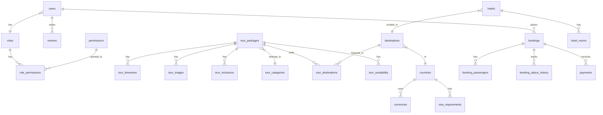

# MASTER IMPLEMENTATION PLAN
## City One Adventures — Worldwide Tour & Travel Management System

---

## 1. File Inspection Summary

### What Exists
| Asset | Status | Decision |
|---|---|---|
| [logo.png](file:///c:/Users/User/Music/cityone/CityOne/support%20files/logo.png) | ✅ Company logo (giraffe + rhino + Africa silhouette, green & orange) | **Keep** — use throughout new system |
| [App.jsx](file:///c:/Users/User/Music/cityone/CityOne/src/App.jsx) | React SPA (1122 lines, single-file, localStorage CMS) | **Extract content only** — architecture will be rebuilt |
| [App.css](file:///c:/Users/User/Music/cityone/CityOne/src/App.css) | Styles with gradients (violates requirements) | **Redesign** — solid colors only |
| [server.js](file:///c:/Users/User/Music/cityone/CityOne/server.js) | Minimal Express server (health + inquiry endpoints) | **Replace** with full backend |
| [favicon.svg](file:///c:/Users/User/Music/cityone/CityOne/public/favicon.svg) | ✅ SVG favicon | **Replace** with logo image |
| [icons.svg](file:///c:/Users/User/Music/cityone/CityOne/public/icons.svg) | ✅ Icon sprite | **Keep** |
| [sitemap.xml](file:///c:/Users/User/Music/cityone/CityOne/public/sitemap.xml) | Static sitemap for cityoneadventure.com | **Replace** with dynamic generation |
| [site.webmanifest](file:///c:/Users/User/Music/cityone/CityOne/public/site.webmanifest) | PWA manifest stub | **Keep & enhance** |

### Business Information Extracted
- **Company**: City One Adventures
- **Domain**: cityoneadventure.com
- **Location**: Kampala Road, Liberty Tower, Level 3, Kampala, Uganda
- **Phone**: 0786870308
- **Email**: info@cityoneadventure.com
- **WhatsApp**: 0786870308
- **Primary Colors**: Deep forest green (#173a2d / #153d2f), Orange accent (#f06b2d)
- **Brand Identity**: African wildlife, nature, adventure, professional tourism
- **Destinations**: Kampala, Jinja, Murchison Falls, Queen Elizabeth NP, Bwindi, Fort Portal
- **Tours**: Wildlife Safari, Gorilla Trekking, Source of the Nile, Kampala Culture
- **Services**: Tour Planning, Safari Packages, Airport Transfers, Car Hire, Accommodation, Guided Tours, Group Travel, Corporate Travel, Custom Experiences
- **Social Media**: City One Adventures on Facebook, Twitter, YouTube, and Instagram

### What Will NOT Be Reused
- React framework (requirements specify vanilla HTML/CSS/JS)
- localStorage-based CMS (will be MySQL-backed)
- Gradient styles (explicitly prohibited)
- Single-file architecture

---

## 2. Proposed System Architecture

```
┌─────────────────────────────────────────────────────────────────┐
│                        NGINX (Reverse Proxy)                     │
│                    SSL Termination / Static Files                 │
└──────────────────────────┬──────────────────────────────────────┘
                           │
┌──────────────────────────▼──────────────────────────────────────┐
│                    Node.js / Express.js Server                   │
│                    (PM2 Process Manager)                          │
├─────────────────────────────────────────────────────────────────┤
│  PUBLIC ROUTES          │  API ROUTES         │  ADMIN ROUTES    │
│  / (home)               │  /api/auth/*        │  /admin/*        │
│  /tours                 │  /api/tours/*       │  /admin/api/*    │
│  /tours/:slug           │  /api/bookings/*    │                  │
│  /destinations          │  /api/payments/*    │                  │
│  /destinations/:slug    │  /api/customers/*   │                  │
│  /services              │  /api/reviews/*     │                  │
│  /about                 │  /api/contact/*     │                  │
│  /contact               │  /api/currencies/*  │                  │
│  /account/*             │  /api/upload/*      │                  │
└─────────────────────────┴─────────────────────┴──────────────────┘
                           │
┌──────────────────────────▼──────────────────────────────────────┐
│                        MySQL Database                            │
│                    (InnoDB, UTF8MB4)                              │
└─────────────────────────────────────────────────────────────────┘
```

**Architecture Pattern**: Server-Side Rendered (SSR) with EJS templates for SEO + vanilla JS for interactivity on the client side. RESTful JSON API layer for AJAX operations (bookings, payments, admin CRUD).

---

## 3. Technology Stack

| Layer | Technology | Justification |
|---|---|---|
| **Runtime** | Node.js 18+ LTS | As specified |
| **Framework** | Express.js 5.x | As specified |
| **Template Engine** | EJS | Server-rendered HTML for SEO; no heavy frontend framework needed |
| **Database** | MySQL 8.0 | As specified |
| **DB Client** | mysql2 + knex.js | Secure parameterized queries, migrations, query builder |
| **Auth** | bcrypt + JWT + express-session | Password hashing + token auth + session cookies |
| **Validation** | express-validator | Input sanitization and validation |
| **File Upload** | multer | Secure file upload handling |
| **Email** | nodemailer | Transactional emails (configurable SMTP) |
| **Process Manager** | PM2 | Production process management |
| **Reverse Proxy** | Nginx | SSL, static files, load balancing |
| **Frontend** | HTML5 + CSS3 + Vanilla JS | As specified — no framework |
| **Icons** | Lucide Icons (SVG) | Lightweight, no external dependencies |
| **Charts** | Chart.js (CDN) | Admin dashboard charts |
| **Maps** | Leaflet.js (free) + OpenStreetMap | No API key required for basic maps |

---

## 4. Database / ERD Design

### Entity Relationship Summary (35+ tables)



### Full Table List

**Users & Organization (6 tables)**
| Table | Purpose |
|---|---|
| `users` | All system users (customers, staff, admins) |
| `roles` | Role definitions (super_admin, admin, staff, customer) |
| `permissions` | Granular permission definitions |
| `role_permissions` | Role-to-permission mapping |
| `departments` | Staff departments |
| `password_resets` | Password reset tokens |

**Geography (3 tables)**
| Table | Purpose |
|---|---|
| `countries` | 195+ countries with codes, phone codes, flags |
| `destinations` | Travel destinations with descriptions, images, SEO |
| `currencies` | World currencies with exchange rates |

**Tours (7 tables)**
| Table | Purpose |
|---|---|
| `tour_categories` | Safari, Cultural, Adventure, etc. |
| `tour_packages` | Main tour listings |
| `tour_itineraries` | Day-by-day itinerary items |
| `tour_images` | Tour photo gallery |
| `tour_inclusions` | What's included/excluded |
| `tour_destinations` | Tour-to-destination mapping |
| `tour_availability` | Date-based availability & pricing |

**Booking (4 tables)**
| Table | Purpose |
|---|---|
| `bookings` | Booking records with references like TOUR-2026-000001 |
| `booking_passengers` | Individual traveler details |
| `booking_status_history` | Status change audit trail |
| `booking_items` | Line items (tours, extras, transfers) |

**Payments (3 tables)**
| Table | Purpose |
|---|---|
| `payments` | Payment records |
| `payment_transactions` | Transaction log (attempts, callbacks) |
| `refunds` | Refund records |

**Hotels (3 tables)**
| Table | Purpose |
|---|---|
| `hotels` | Hotel listings |
| `hotel_rooms` | Room types and pricing |
| `hotel_bookings` | Room reservations |

**Transportation (2 tables)**
| Table | Purpose |
|---|---|
| `transportation` | Vehicle/service listings |
| `transport_bookings` | Transport reservations |

**Visa (1 table)**
| Table | Purpose |
|---|---|
| `visa_requirements` | Country-based visa info |

**Customer Interaction (4 tables)**
| Table | Purpose |
|---|---|
| `reviews` | Tour/destination reviews |
| `notifications` | User notifications |
| `contact_messages` | Contact form submissions |
| `enquiries` | Tour/booking enquiries |

**Content Management (4 tables)**
| Table | Purpose |
|---|---|
| `site_settings` | Key-value site configuration |
| `pages` | CMS pages (about, services, etc.) |
| `faqs` | FAQ entries |
| `media` | Uploaded files registry |

**System (2 tables)**
| Table | Purpose |
|---|---|
| `audit_logs` | System audit trail |
| `email_logs` | Email delivery tracking |

---

## 5. Main System Modules

| Module | Public | Customer | Staff | Admin |
|---|---|---|---|---|
| Website/CMS | ✅ | — | — | ✅ Edit |
| Tours | ✅ Browse | ✅ Book | ✅ View | ✅ CRUD |
| Destinations | ✅ Browse | — | — | ✅ CRUD |
| Bookings | — | ✅ Own | ✅ Assigned | ✅ All |
| Payments | — | ✅ Own | ✅ View | ✅ Manage |
| Reviews | ✅ Read | ✅ Write | ✅ View | ✅ Moderate |
| Hotels | ✅ Browse | ✅ Book | ✅ View | ✅ CRUD |
| Transport | ✅ Browse | ✅ Book | — | ✅ CRUD |
| Visa Info | ✅ Browse | ✅ View | — | ✅ CRUD |
| Users | — | ✅ Profile | — | ✅ CRUD |
| Dashboard | — | ✅ Own | ✅ Limited | ✅ Full |
| Reports | — | — | ✅ Limited | ✅ Full |
| Notifications | — | ✅ Own | ✅ Own | ✅ Send |
| Media | — | — | — | ✅ Manage |
| Settings | — | — | — | ✅ Edit |

---

## 6. API Architecture

### Public API (no auth)
```
GET    /api/tours                    # List tours (paginated, filterable)
GET    /api/tours/:slug              # Tour details
GET    /api/destinations             # List destinations
GET    /api/destinations/:slug       # Destination details
GET    /api/categories               # Tour categories
GET    /api/reviews/:tourId          # Tour reviews
GET    /api/countries                # Countries list
GET    /api/currencies               # Active currencies
GET    /api/visa/:countryCode        # Visa requirements
POST   /api/contact                  # Contact form submission
POST   /api/enquiries                # Tour enquiry
```

### Auth API
```
POST   /api/auth/register            # Customer registration
POST   /api/auth/login               # Login (returns JWT + sets cookie)
POST   /api/auth/logout              # Logout
POST   /api/auth/forgot-password     # Request reset
POST   /api/auth/reset-password      # Reset with token
GET    /api/auth/me                  # Current user
```

### Customer API (auth required, role: customer)
```
GET    /api/customer/bookings        # My bookings
GET    /api/customer/bookings/:ref   # Booking details
POST   /api/customer/bookings        # Create booking
PUT    /api/customer/bookings/:ref/cancel  # Cancel booking
GET    /api/customer/payments        # Payment history
POST   /api/customer/reviews         # Submit review
GET    /api/customer/notifications   # My notifications
PUT    /api/customer/profile         # Update profile
```

### Admin API (auth required, role: admin+)
```
# Full CRUD for all entities
/api/admin/dashboard               # Dashboard stats
/api/admin/users/*                 # User management
/api/admin/tours/*                 # Tour management
/api/admin/destinations/*          # Destination management
/api/admin/bookings/*              # Booking management
/api/admin/payments/*              # Payment management
/api/admin/hotels/*                # Hotel management
/api/admin/transport/*             # Transport management
/api/admin/reviews/*               # Review moderation
/api/admin/content/*               # CMS content
/api/admin/settings/*              # Site settings
/api/admin/media/*                 # Media management
/api/admin/reports/*               # Reports
```

---

## 7. UI/UX Design Direction

### Color Palette (Solid Colors Only — NO GRADIENTS)

| Token | Color | Usage |
|---|---|---|
| `--color-primary` | `#1a3c34` | Deep forest green — headers, nav, footer |
| `--color-primary-light` | `#2d5a4a` | Hover states, secondary backgrounds |
| `--color-primary-dark` | `#0f2920` | Active states, dark text |
| `--color-accent` | `#e8612d` | CTA buttons, highlights, badges |
| `--color-accent-hover` | `#d4551f` | Button hover |
| `--color-surface` | `#ffffff` | Cards, forms, content areas |
| `--color-background` | `#f4f1ec` | Page background (warm off-white) |
| `--color-text` | `#1e2d26` | Body text |
| `--color-text-muted` | `#5a6d63` | Secondary text |
| `--color-border` | `#d8d3cb` | Borders, dividers |
| `--color-success` | `#2d8659` | Success states |
| `--color-warning` | `#c47a20` | Warning states |
| `--color-danger` | `#c43333` | Error/danger states |
| `--color-info` | `#2d6486` | Info states |

### Typography
- **Headings**: "Outfit" (Google Fonts) — bold, modern, adventurous
- **Body**: "Inter" (Google Fonts) — clean, readable

### Design Principles
- Solid color backgrounds only (no gradients anywhere)
- Clean card-based layouts with subtle borders
- Nature-inspired but professional
- Generous whitespace
- Large hero images (Unsplash travel photos)
- Rounded corners (12-16px for cards, 8px for inputs)
- Subtle box shadows (no heavy drops)
- Consistent spacing system (8px grid)
- Mobile-first responsive breakpoints at 480px, 768px, 1024px, 1280px

---

## 8. Security Architecture

| Layer | Implementation |
|---|---|
| **Password Storage** | bcrypt with salt rounds = 12 |
| **Authentication** | JWT (access token, 15min) + HTTP-only cookie (refresh, 7 days) |
| **Authorization** | Role-based middleware + permission checks on every API endpoint |
| **Input Validation** | express-validator on all inputs |
| **SQL Injection** | Parameterized queries via knex.js (no raw string concatenation) |
| **XSS Protection** | Output escaping in EJS templates + helmet.js security headers |
| **CSRF** | csurf middleware for form submissions |
| **Rate Limiting** | express-rate-limit (100 req/15min for auth, 1000 for general) |
| **File Uploads** | Multer with type whitelist (jpg/png/webp), 5MB limit, sanitized filenames |
| **CORS** | Configured whitelist |
| **Headers** | helmet.js (HSTS, X-Frame-Options, CSP, etc.) |
| **Sessions** | express-session with MySQL store |
| **Logging** | winston logger — no sensitive data in logs |
| **Environment** | dotenv — all secrets in .env (never committed) |

---

## 9. Hosting / Deployment Architecture

```
┌──────────────────────────────────────────────┐
│              Hostinger VPS (Ubuntu)            │
├──────────────────────────────────────────────┤
│                                               │
│  ┌─────────────┐    ┌──────────────────────┐ │
│  │    Nginx     │───▶│   Node.js (PM2)      │ │
│  │  Port 80/443 │    │   Port 3000          │ │
│  │  SSL (Let's  │    │                      │ │
│  │   Encrypt)   │    │  Express.js App      │ │
│  └─────────────┘    └──────────┬───────────┘ │
│                                │              │
│                     ┌──────────▼───────────┐ │
│                     │    MySQL 8.0          │ │
│                     │    Port 3306          │ │
│                     │    (localhost only)    │ │
│                     └──────────────────────┘ │
│                                               │
│  /var/www/cityone/                            │
│  ├── current/ (app code)                     │
│  ├── uploads/ (media files)                  │
│  ├── logs/ (application logs)                │
│  └── backups/ (db backups)                   │
│                                               │
└──────────────────────────────────────────────┘
```

---

## 10. Development Phases

| Phase | Scope | Key Deliverables |
|---|---|---|
| **1. Foundation** | Project setup, Express config, MySQL connection, middleware | Running server skeleton |
| **2. Database** | Schema, migrations, seed data, 35+ tables | Complete database with demo data |
| **3. Backend** | All routes, controllers, services, models, auth, RBAC | Complete API layer |
| **4. Public Frontend** | Home, Tours, Destinations, Services, About, Contact | Full public website |
| **5. Customer System** | Registration, login, dashboard, profile, booking views | Customer portal |
| **6. Booking System** | Tour selection, booking flow, status, confirmation | Working booking pipeline |
| **7. Admin System** | Dashboard, all CRUD, CMS, user/booking/payment management | Full admin panel |
| **8. Integrations** | Email (nodemailer), Maps (Leaflet), Currency API, Payment scaffold | Connected services |
| **9. Security** | Audit, fix vulnerabilities, harden headers, CSRF, rate limiting | Security hardened |
| **10. Testing** | End-to-end verification, forms, auth, CRUD, mobile, errors | Test report |
| **11. Production Prep** | PM2 config, Nginx config, SSL setup, .env.example | Deployment-ready |
| **12. Documentation** | README, API docs, admin guide, deployment guide, checklists | Complete docs |
| **13. Global Performance & SEO** | CDN configuration, image optimization (sharp), dynamic sitemap, JSON-LD Schema markup | SEO & Speed optimized |
| **14. Disaster Recovery** | Automated daily MySQL backups to off-site storage (S3) | Backup cron jobs |

---

## 11. Project Structure

```
CityOne/
├── config/
│   ├── database.js           # MySQL/knex configuration
│   ├── email.js              # Nodemailer configuration
│   ├── auth.js               # JWT/session configuration
│   └── upload.js             # Multer configuration
├── controllers/
│   ├── public/               # Public page controllers
│   ├── api/                  # REST API controllers
│   ├── admin/                # Admin controllers
│   └── customer/             # Customer area controllers
├── middleware/
│   ├── auth.js               # Authentication middleware
│   ├── rbac.js               # Role-based access control
│   ├── validate.js           # Input validation
│   ├── upload.js             # File upload handling
│   ├── rateLimit.js          # Rate limiting
│   └── errorHandler.js       # Global error handler
├── models/                   # Database models (knex-based)
├── routes/
│   ├── public.js             # Public website routes
│   ├── api.js                # API routes
│   ├── admin.js              # Admin routes
│   └── customer.js           # Customer routes
├── services/                 # Business logic layer
├── migrations/               # Knex database migrations
├── seeds/                    # Knex seed data
├── views/                    # EJS templates
│   ├── layouts/              # Base layouts
│   ├── partials/             # Reusable components
│   ├── public/               # Public pages
│   ├── admin/                # Admin pages
│   ├── customer/             # Customer pages
│   └── errors/               # Error pages
├── public/                   # Static assets
│   ├── css/                  # Stylesheets
│   ├── js/                   # Client-side JavaScript
│   ├── images/               # Static images
│   └── uploads/              # User uploads
├── utils/                    # Helper utilities
├── logs/                     # Application logs
├── .env.example              # Environment template
├── .gitignore
├── knexfile.js               # Knex configuration
├── server.js                 # Application entry point
├── package.json
├── ecosystem.config.js       # PM2 configuration
├── nginx.conf.example        # Nginx configuration template
└── README.md
```

---

## 12. Important Assumptions

1. **Domain**: `cityoneadventure.com` (as found in existing code)
2. **Primary Market**: Uganda-based company serving worldwide tourists
3. **Default Currency**: USD (with multi-currency support)
4. **Language**: English initially (architecture supports future i18n)
5. **Maps**: Using Leaflet.js + OpenStreetMap (free, no API key needed)
6. **Payment**: Building Flutterwave integration scaffold (popular in East Africa) — sandbox mode only until credentials provided
7. **Email**: Nodemailer with SMTP configuration — will work locally with test mode, needs SMTP credentials for production
8. **Tour Prices**: Prices in the existing data show placeholders `[STARTING PRICE]` — seed data will use realistic demo prices
9. **Images**: Using Unsplash URLs for demo (same as existing site) — admin can upload real images
10. **Social Media URLs**: Placeholders until real URLs provided

---

## 13. External API Credentials Required

| Service | Required For | Status | What You Need |
|---|---|---|---|
| **SMTP Email** (e.g., Gmail, SendGrid, Mailgun) | Sending transactional emails | 🟡 Placeholder | SMTP host, port, username, password |
| **Flutterwave** (or alternative payment gateway) | Processing payments | 🟡 Sandbox scaffold | Public key, Secret key, Encryption key |
| **Exchange Rate API** (e.g., exchangerate-api.com) | Currency conversion | 🟡 Free tier available | API key (free plan available) |
| **Google Maps API** *(optional)* | Enhanced map embedding | 🟢 Using free Leaflet/OSM instead | Not required |
| **Google Analytics** *(optional)* | Website analytics | 🟡 Placeholder in template | GA Measurement ID |
| **Cloudinary** *(optional)* | Cloud image storage/CDN | 🟢 Using local uploads | Not required |

> [!IMPORTANT]
> **No credentials will be invented or hard-coded.** The system will function locally with sandbox/test modes. Production credentials must be added to the `.env` file before going live.

---

## Decision Required

**Should I proceed with this plan?** Once approved, I will begin Phase 1 immediately and continue through all 12 phases without stopping.
